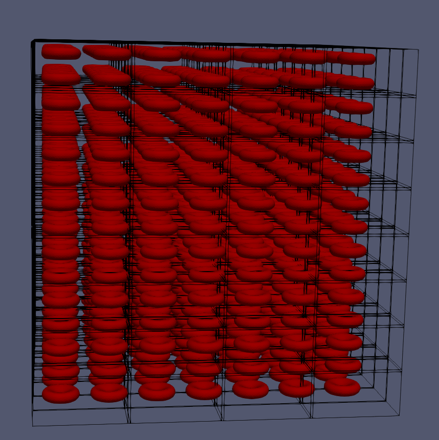

xml files that descibe the shape of the particles.
empty pos file for the platelets.
empty pos file for the RBCs (RBC-h000.pos)

RBC-h018.pos: is a file with 18% hematocrit, where all the RBCs are evenly divided along the domain. This file fills a domain up-to 800x800x800 LU. 

