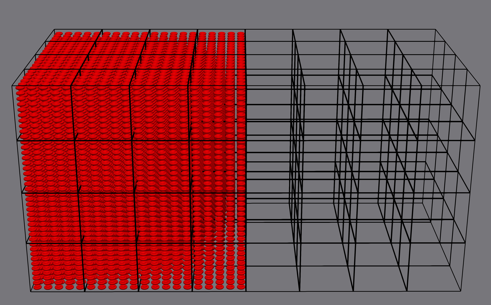

# Cube
This benchmark is based on the cube-benchmark case.
The imbalance comes from imbalanced distribution of RBCs.
This is done by giving imbalance RBC.pos files.

##

A visual representation of the cube imbalance hemocell setup

