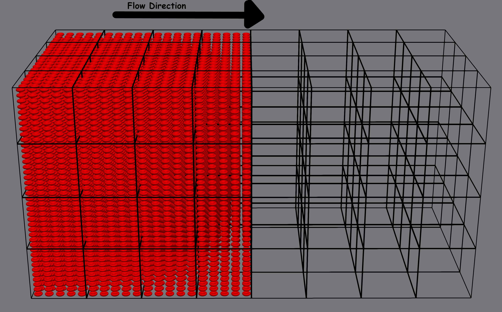

# Cube
In this benchmark, part of the domain is filled with RBCs.
We add a flow such that the RBCs will move through the domain.
This will create dynamic changing load imbalance.

##

A visual representation of the cube imbalance hemocell setup

